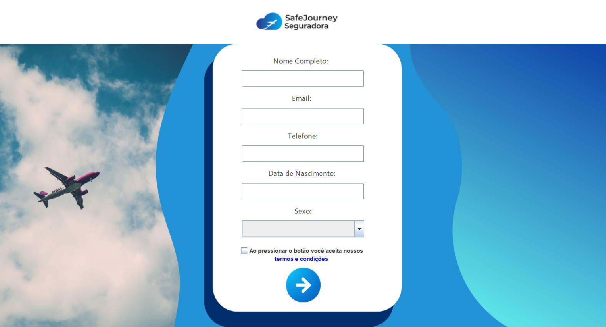

# Projeto Final: Sementes do Brasil Tech

## Descrição Geral
Este projeto foi desenvolvido durante o programa Sementes do Brasil Tech, com o objetivo de criar uma aplicação para uma seguradora de viagens internacionais. Utilizamos a linguagem Java com orientação a objetos para o back-end e aplicamos o modelo MVC. Abaixo estão os detalhes específicos do projeto:

---

## Tecnologias Utilizadas

### Linguagem de Programação
- **Java**: Orientação a objetos, ideal para grandes sistemas.

### Arquitetura
- **Modelo MVC**: Separação de responsabilidades para melhor manutenção do código.

### Banco de Dados
- **Oracle**: Comunicação com o banco de dados via OJDBC.

### Interface Gráfica
- **Java Swing**: Criação de interfaces gráficas robustas e interativas.

---

## Funcionalidades Implementadas

### Cadastro de Clientes
Desenvolvemos um módulo completo para o cadastro de clientes, onde adicionamos um novo cliente ao nosso banco de dados..

### Sistema de Login
Implementação de um sistema de login seguro, que valida e verifica login e senha do usuario.

### Cotação de Planos
Funcionalidade que permite aos usuários adicionar os dados da viagem como quantidade de pesspas data de ida e volta local de destino entre outros.

com os dados obtidos sao calculados preços dinâmicos que variam conforme as condições.

---

## Funcionalidades Adicionais

### Chatbot Auxiliar
Desenvolvemos um chatbot para auxiliar na navegação do aplicativo, oferecendo respostas rápidas e automáticas às dúvidas dos usuários.

sendo uma de suas funcionalidades a integração de um sistema de cotação de moedas em tempo real utilizando uma API via HTTP, permitindo aos usuários obter informações atualizadas sobre taxas de câmbio.

---

## Conclusão
Este projeto foi um grande desafio e aprendizado, permitindo a aplicação prática de diversos conceitos e tecnologias. A integração de múltiplos módulos e a criação de funcionalidades adicionais, como o chatbot e o sistema de cotação de moedas, enriqueceram ainda mais a experiência do usuário.
